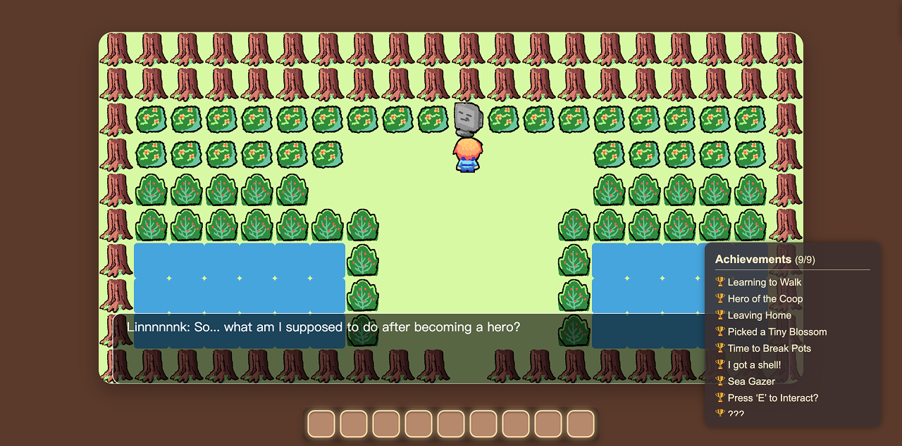

# how to become linnnnnnk
*There’s no world waiting to be saved, no destiny begging to be fulfilled.*

**It’s not the treasures that make a hero — it’s the stories they walk through.**

This is a small and cozy top-down, tile-based web game inspired by classic adventure titles, but the quest has been turned inside out.

* Suetex: In charge of the original concept, story writing, and artwork.
* robinnnnnns: In charge of p5.js programming and level design.
* soysauceovo: In charge of sound design and artwork.

Actually, two of us had to take cross-continental flights within those three days, so it was an intense and unforgettable experience we’ll never forget.

